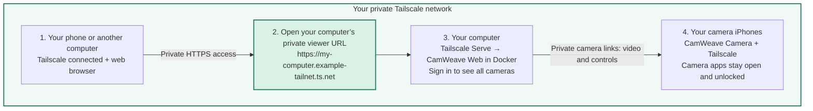

# CamWeave Web

**See your CamWeave cameras together, from a browser on your computer or phone.**

A free, MIT-licensed, self-hosted companion to CamWeave Camera. Save multiple cameras, view four live feeds at once, and open a camera to adjust quality, frame rate and ISO with one **Apply settings** button. No cloud account, subscription, analytics or external frontend assets. This is a viewer, not camera capture software or a recorder.

## What you need

- A CamWeave Camera running on each camera device (camera build 9+ for ISO controls).
- A computer or VPS running Docker Compose (recommended), or Node.js 24+.
- Camera viewing links, including their access codes.
- A network path **from the server to every camera**, and **from your browser to the server**.

Keep the iPhone camera app open in the foreground. Locking the phone or backgrounding it pauses capture. Four feeds per signed-in session are supported; each camera also has its own viewer limit. Video bandwidth passes through your server, so VPS data-transfer charges may apply. There is no recording, playback, motion detection or notification feature in this release.

## Recommended: Docker Compose

Prebuilt images are published at `ghcr.io/camweave-project/camweave-web` for **linux/amd64** and **linux/arm64**. Public pulls need no GitHub login. The default Compose file pins version `1.0.1`; no local build or Node.js installation is needed.

```sh
mkdir camweave-web
cd camweave-web
curl -fsSLO https://raw.githubusercontent.com/camweave-project/camweave-web/v1.0.1/compose.yaml
curl -fsSL https://raw.githubusercontent.com/camweave-project/camweave-web/v1.0.1/.env.example -o .env
```

Edit `.env` before starting:

- Replace `ADMIN_PASSWORD` with a unique random password of at least 16 characters. A password manager can generate it.
- Set `CAMERA_HOSTS` to the exact hostnames or IP addresses from your camera links, without ports or paths. This allowlist prevents arbitrary URL proxying.
- Keep `PUBLIC_URL=http://127.0.0.1:8080` for local use; set your private HTTPS origin when using a reverse proxy.

```sh
docker compose pull
docker compose up -d
```

Open `http://127.0.0.1:8080`, sign in with your server password, and add each camera’s full viewing link. Camera links are saved in a named Docker volume. The port is bound to localhost by default; follow the private-network guide below to view from another device.

Your container must be able to resolve and route to the cameras. A VPN on the host does not automatically provide its DNS and routes to Docker containers.

After changing `.env`, run `docker compose up -d` to recreate the service with the new settings. For upgrades, change the image version in `compose.yaml`, then run `docker compose pull && docker compose up -d`. Back up the camera volume first. `docker compose down` keeps that volume; adding `-v` deletes it. A moving `latest` tag is also published, but pinned versions make upgrades deliberate.

## Alternative: run from source

Requires Node.js 24+; useful for development or when the VPN-connected host has routes Docker cannot use.

```sh
git clone https://github.com/camweave-project/camweave-web.git
cd camweave-web
cp .env.example .env
# Configure .env as described above.
npm start
```

No npm dependencies need installing. To build your own container, run `docker build -t camweave-web:local .` and replace the `image:` value in Compose with `camweave-web:local`.

## Watch from another device or deploy on a VPS

### Your computer + Tailscale: which address do I open?

**Open your computer’s private Tailscale HTTPS address to see all your cameras.** It looks like a website address, but with Tailscale Serve it is reachable only through your private Tailscale network, subject to your access rules. CamWeave Web runs on your own computer, which must stay awake and connected.



The address above is an **example**. Copy the real HTTPS URL printed by `tailscale serve`; do not type the example literally.

| Where you are | Address to use |
|---|---|
| Browser on the computer running CamWeave Web, before setting up Serve | `http://127.0.0.1:8080` — this computer only |
| Browser on your phone or another computer, after setting up Serve | Your computer’s `https://…ts.net` URL — connect to Tailscale first |
| Adding a camera inside CamWeave Web | The camera’s full private viewing link, including its access code — not the computer’s viewer URL |

After configuring `PUBLIC_URL` for Serve, use that HTTPS URL on the host computer too. `127.0.0.1` always means the device you are currently using; on your phone, it does **not** mean your computer. Keep the camera’s private hostname and port from its actual viewing link; a camera’s Tailscale IP may look like `100.x.y.z`, but changing an IP into a URL does not configure HTTPS.

**Private access, with two checks:** Tailscale must allow the device to reach your computer, and the viewer requires your CamWeave Web password. The browser-to-computer and computer-to-camera connections use Tailscale’s encrypted network. This setup does not publish the viewer to the public internet. Use **Tailscale Serve**, keep Docker’s `127.0.0.1:8080` port binding, and do not enable Funnel or router port forwarding. Privacy still depends on trusted devices, strong passwords/access codes, and appropriate Tailscale access rules; no setup can guarantee absolute security.

### Set it up on your computer

1. Install [Tailscale](https://tailscale.com/download) on the computer, camera iPhones and viewing devices. Connect them to your personal Tailscale network, with access allowed only for the intended devices and people.
2. Start CamWeave Web using the Docker Compose steps above. Set `CAMERA_HOSTS` to the cameras’ private hostnames or IP addresses. The Docker container must be able to reach them; test a camera in the viewer before relying on remote access.
3. On the computer running Docker, run:

   ```sh
   tailscale serve --bg http://127.0.0.1:8080
   ```

   Follow Tailscale’s HTTPS setup prompt if shown. Copy the URL marked **Available within your tailnet**. You can check it again with `tailscale serve status`.
4. Set `PUBLIC_URL` in `.env` to that exact HTTPS origin, without a path, then run `docker compose up -d`. Keep the strong `ADMIN_PASSWORD` you configured earlier.
5. On the viewing phone or computer, connect Tailscale, open that HTTPS URL, sign in, and add the cameras’ private viewing links. Use the same URL at home or away. Keep the host computer awake and the camera apps open.

**Quick privacy check:** from a separate viewing device on mobile data or another outside network, disconnect Tailscale and try opening a fresh viewer page. It should be unreachable. Reconnect Tailscale and confirm the viewer works. This checks the intended access path, not every possible security risk.

See [Tailscale Serve](https://tailscale.com/docs/features/tailscale-serve) and the [Serve command reference](https://tailscale.com/docs/reference/tailscale-cli/serve) for private access, HTTPS and access-control details.

### LAN and VPS alternatives

**At home:** the server and cameras can use your existing reachable LAN. To watch from other devices, use a private HTTPS reverse proxy (such as Tailscale Serve) in front of the local listener. LAN-only HTTP is possible with a deliberately configured LAN `HOST` and `PUBLIC_URL`, but passwords and footage then depend on that network’s protection; use HTTPS or an encrypted VPN.

**On a VPS:** install your choice of private-network software on the VPS, camera devices and viewing devices. Join the same permitted private network, and add the cameras by their private DNS names or IP addresses. A VPS cannot reach a home `192.168.x.x` address unless you explicitly provide routing, such as a VPN subnet router. No CamWeave-hosted relay is involved.

For a VPS, follow the same five Tailscale steps above, using the VPS wherever the instructions say “your computer”. Keep port 8080 closed in the cloud firewall. Allow only the necessary viewer → server and server → camera connections in your private-network policy.

Tailscale is optional. WireGuard, ZeroTier, NetBird or another private network can work when DNS, routing and access rules provide both paths. CamWeave does not configure those networks for you. Reverse proxies must preserve the original `Host` and `Origin`, support streaming without buffering, and use a timeout longer than 60 seconds.

## Security and privacy

- The **server is trusted**: it relays video and stores camera links (including access codes) in `data/cameras.json`, with owner-only file permissions. Its administrator and anyone with its server password can view and control all saved cameras. There are no separate user roles.
- Storage is not encrypted at rest. Protect the machine, disks, data directory, Docker volume and backups. Never commit `.env`, camera data or access codes to Git. Use long random camera codes, even though camera software permits shorter ones.
- Login is required for every feed, status and control request. Sessions use HttpOnly/SameSite cookies and expire after 12 hours. HTTPS origins also use Secure cookies. Restart to revoke all sessions; rotate the server password in `.env` and restart if compromised.
- Requests are limited to configured camera hosts and documented endpoints. Redirects are refused; link-local/metadata destinations are blocked; HTTPS camera certificates are checked. Do not allow untrusted people to change `CAMERA_HOSTS`.
- No anonymous sharing or public deployment preset is included. An internet-facing installation needs additional operator-managed TLS, access control and hardening. The supported starting point is a trusted private network.
- Adding a camera stores its link; deleting it removes that saved entry. Live video is forwarded without recording. Browsers and network providers still process data as needed to deliver it.

## Development

`npm test` runs real HTTP integration tests for authentication, CSRF/Host checks, camera persistence, proxy controls, live multipart forwarding, URL restrictions, redirection rejection and logout. `node --check public/app.js` checks browser-script syntax.

The app deliberately uses same-origin proxying: browsers do not need to contact each private camera directly, and camera access codes do not appear in browser image URLs. This avoids camera CORS and HTTPS mixed-content issues while making the server part of the trusted path.

## Configuration

| Variable | Default | Meaning |
|---|---|---|
| `ADMIN_PASSWORD` | Required | Shared owner password; at least 16 characters |
| `CAMERA_HOSTS` | Empty | Comma-separated exact allowed camera hosts |
| `PUBLIC_URL` | `http://127.0.0.1:8080` | Exact browser-facing origin, including nonstandard port |
| `HOST` | `127.0.0.1` | Node listener address; Docker listens internally on `0.0.0.0` |
| `PORT` | `8080` | Listener port |
| `DATA_DIR` | `./data` | Persistent camera-link storage directory |

MIT © Jianxuan Li. See [LICENSE](LICENSE).

## Image releases

Pushing a `v*` release tag runs the test suite and publishes amd64/arm64 images to GHCR with the version and `latest` tags. The workflow uses its temporary GitHub token with package-write permission; no Docker Hub account or registry password is needed. Only publish stable release tags matching `package.json`. The image includes the MIT license and source/revision metadata.
